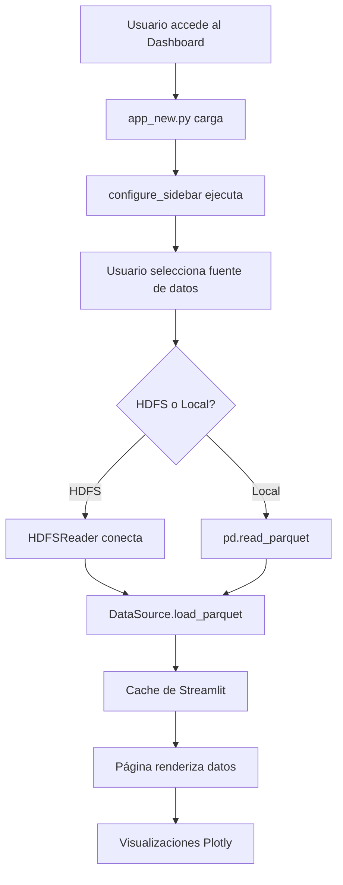

# climaXtreme Dashboard - Modern Multi-Page Architecture

## 🎯 Overview

El dashboard de climaXtreme ha sido completamente modernizado usando la arquitectura de **páginas múltiples** de Streamlit, diseñado específicamente para aprovechar los **11 archivos Parquet** procesados por Apache Spark y almacenados en HDFS.

## 🏗️ Arquitectura

```
dashboard/
├── app_new.py              # Aplicación principal (Home)
├── utils.py                # Utilidades compartidas
└── pages/                  # Auto-descubrimiento de páginas
    ├── 1_📈_Temporal_Analysis.py
    ├── 2_🌡️_Anomalies.py
    ├── 3_🍂_Seasonal_Analysis.py
    ├── 4_⚡_Extreme_Events.py
    ├── 5_🗺️_Regional_Analysis.py
    ├── 6_🌐_Continental_Analysis.py
    └── 7_📊_Statistical_Analysis.py
```

### Auto-descubrimiento de Páginas

Streamlit automáticamente detecta y carga todas las páginas del directorio `pages/`. El prefijo numérico determina el orden en la navegación.

## 📊 Páginas del Dashboard

### 1. 🏠 Home (app_new.py)
- **Propósito**: Punto de entrada y overview del sistema
- **Datos**: `descriptive_stats.parquet`
- **Características**:
  - Estado del sistema y conexión HDFS
  - Lista de datasets disponibles
  - Estadísticas rápidas globales
  - Guía de navegación

### 2. 📈 Temporal Analysis
- **Propósito**: Análisis de tendencias temporales
- **Datos**: `monthly.parquet`, `yearly.parquet`
- **Características**:
  - Tendencias mensuales con heatmaps
  - Tendencias anuales con líneas de regresión
  - Comparación interactiva entre ciudades
  - Análisis por década

### 3. 🌡️ Anomalies
- **Propósito**: Desviaciones de temperatura vs climatología
- **Datos**: `anomalies.parquet`, `climatology.parquet`
- **Características**:
  - Gráficas de barras de anomalías (rojo/azul)
  - Comparación observado vs climatológico
  - Distribución de anomalías
  - Ciclo estacional climatológico

### 4. 🍂 Seasonal Analysis
- **Propósito**: Patrones estacionales
- **Datos**: `seasonal.parquet`
- **Características**:
  - Comparación de temperaturas por estación
  - Evolución estacional en el tiempo
  - Box plots de distribución estacional

### 5. ⚡ Extreme Events
- **Propósito**: Identificación de eventos extremos
- **Datos**: `extreme_thresholds.parquet`, `monthly.parquet`
- **Características**:
  - Umbrales P10 y P90 por mes
  - Detección automática de eventos extremos
  - Listado de eventos recientes
  - Tabla de umbrales mensuales

### 6. 🗺️ Regional Analysis
- **Propósito**: Análisis de 16 regiones geográficas
- **Datos**: `regional.parquet`
- **Características**:
  - Mapa interactivo global con scatter geo
  - Comparación de temperaturas regionales
  - Tendencias por región
  - Estadísticas regionales

### 7. 🌐 Continental Analysis
- **Propósito**: Vista global por continentes
- **Datos**: `continental.parquet`
- **Características**:
  - Mapa continental con burbujas
  - Análisis de cambio de temperatura
  - Tendencias por continente
  - Análisis por década

### 8. 📊 Statistical Analysis
- **Propósito**: Análisis estadístico profundo
- **Datos**: `descriptive_stats.parquet`, `correlation_matrix.parquet`, `chi_square_tests.parquet`
- **Características**:
  - Estadísticas descriptivas completas
  - Heatmap de correlaciones
  - Tests de independencia Chi-cuadrado
  - Interpretaciones estadísticas

## 🔧 Configuración

### Requisitos
```bash
pip install streamlit pandas plotly pyarrow
```

### Lanzar el Dashboard

#### Método 1: Directamente con Streamlit
```bash
cd Tools/src/climaxtreme/dashboard
streamlit run app_new.py
```

#### Método 2: Via CLI de climaXtreme
```bash
climaxtreme dashboard --host localhost --port 8501
```

### Configuración de Datos

El dashboard soporta dos modos:

#### 1. HDFS (Recomendado)
- **Host**: `climaxtreme-namenode` (configurable)
- **Puerto**: `9000` (configurable)
- **Base Path**: `/data/processed` (configurable)
- **Ventajas**: Lectura directa desde Big Data, sin duplicación

#### 2. Local Files (Fallback)
- **Path**: `DATA/processed` (configurable)
- **Ventajas**: No requiere HDFS, útil para desarrollo local

La configuración se realiza desde el **sidebar** en cualquier página.

## 🎨 Características Principales

### 1. Carga Lazy con Caché
```python
@st.cache_data(ttl=300, show_spinner="📂 Loading data...")
def load_parquet(filename: str) -> pd.DataFrame:
    # Carga eficiente con caché de 5 minutos
```

### 2. Manejo de Estado Global
- Configuración HDFS persistente en `st.session_state`
- No se pierde configuración al cambiar de página
- Test de conexión disponible en sidebar

### 3. Visualizaciones Interactivas
- **Plotly Express**: Gráficas modernas y responsivas
- **Plotly Graph Objects**: Control total de visualizaciones
- **Mapas Geográficos**: Scatter geo con proyección natural earth

### 4. Filtros Inteligentes
- Rangos de años con sliders
- Filtros jerárquicos (País → Ciudad)
- Multi-selección de elementos
- Agregación dinámica (Global / Por País / Por Ciudad)

### 5. Métricas en Tiempo Real
- KPIs con `st.metric()`
- Deltas calculados automáticamente
- Colores contextuales (rojo/verde)

## 📦 Estructura de Datos Esperada

Cada parquet debe tener el esquema definido en `PARQUETS.md`:

### Ejemplo: monthly.parquet
```python
{
    'City': str,
    'Country': str,
    'Latitude': str,
    'Longitude': str,
    'year': int,
    'month': int,
    'avg_temperature': float,
    'min_temperature': float,
    'max_temperature': float,
    'std_temperature': float,
    'record_count': int
}
```

## 🚀 Flujo de Trabajo



## 🛠️ Clase Principal: DataSource

Ubicada en `utils.py`, maneja toda la lógica de carga:

```python
data_source = DataSource()
df = data_source.load_parquet('monthly.parquet')
```

**Características:**
- Auto-detecta modo (HDFS vs Local)
- Manejo robusto de errores
- Logging detallado
- Caché integrado

## 🎯 Ventajas del Nuevo Diseño

### ✅ vs Dashboard Antiguo

| Aspecto | Antiguo | Nuevo |
|---------|---------|-------|
| **Arquitectura** | Monolítico (1 archivo) | Multi-página modular |
| **Navegación** | Tabs anidados | Sidebar con páginas |
| **Carga de datos** | Genérica, intenta inferir | Específica por parquet |
| **Rendimiento** | Carga todo a la vez | Lazy loading por página |
| **Mantenibilidad** | Difícil (1572 líneas) | Fácil (archivos separados) |
| **Extensibilidad** | Modificar archivo grande | Agregar nueva página |
| **Aprovec. HDFS** | Limitado | Optimizado |
| **Visualizaciones** | Básicas | Avanzadas con mapas |

### ✅ Beneficios

1. **Modularidad**: Cada página es independiente
2. **Performance**: Solo carga datos necesarios
3. **Escalabilidad**: Agregar páginas sin tocar código existente
4. **UX Mejorada**: Navegación clara y rápida
5. **Mantenimiento**: Fácil debuggear y actualizar
6. **Diseño Específico**: Cada página optimizada para su parquet

## 📝 Cómo Agregar una Nueva Página

1. Crear archivo en `pages/` con prefijo numérico:
   ```python
   # 8_🆕_New_Analysis.py
   ```

2. Usar template básico:
   ```python
   import streamlit as st
   from climaxtreme.dashboard.utils import DataSource, configure_sidebar
   
   st.set_page_config(page_title="New Analysis", page_icon="🆕", layout="wide")
   configure_sidebar()
   
   st.title("🆕 New Analysis")
   
   data_source = DataSource()
   df = data_source.load_parquet('your_file.parquet')
   
   if df is not None:
       # Tu análisis aquí
       st.write(df.head())
   else:
       st.error("Failed to load data")
   ```

3. Streamlit automáticamente la detecta y muestra en sidebar

## 🐛 Troubleshooting

### Error: "Failed to load X.parquet"
- Verificar que el archivo existe en HDFS: `docker exec namenode hdfs dfs -ls /data/processed/`
- Probar conexión con botón "Test Connection" en sidebar
- Revisar logs: `docker logs climaxtreme-namenode`

### Error: "Module not found: climaxtreme.dashboard.utils"
- Verificar que estás en el directorio correcto
- Instalar paquete: `pip install -e Tools/`

### Página no aparece en sidebar
- Verificar que el archivo está en `pages/`
- Verificar que tiene prefijo numérico: `1_Nombre.py`
- Reiniciar Streamlit

## 📚 Referencias

- **Streamlit Pages**: https://docs.streamlit.io/library/get-started/multipage-apps
- **Plotly**: https://plotly.com/python/
- **HDFS + PyArrow**: https://arrow.apache.org/docs/python/filesystems.html
- **Parquets Documentation**: `Tools/documentation/PARQUETS.md`

## 🔄 Migración desde el Dashboard Antiguo

### Cambios Principales

1. **Imports**: Ahora desde `utils.py`
2. **Carga de datos**: Usar `DataSource` en lugar de funciones directas
3. **Configuración**: Todo en `configure_sidebar()`
4. **Navegación**: Páginas separadas en lugar de tabs

### Script de Migración

```bash
# Backup del dashboard antiguo
mv app.py app_old.py

# Usar nuevo dashboard
mv app_new.py app.py

# Lanzar
streamlit run app.py
```

## 🎉 Conclusión

El nuevo dashboard de climaXtreme está **100% adaptado** a los 11 parquets generados por Spark, con:

- ✅ Páginas específicas para cada tipo de análisis
- ✅ Carga eficiente desde HDFS
- ✅ Visualizaciones avanzadas
- ✅ Arquitectura moderna y mantenible
- ✅ Experiencia de usuario mejorada

**¡Listo para producción!** 🚀
